# 🚀 PLANO DE INTEGRAÇÃO CAKTO - EDITALIZA

## 📋 Visão Geral

Este plano detalha os **3 passos simples** para ativar completamente o sistema de pagamentos CAKTO no Editaliza, transformando a plataforma em um negócio monetizado.

### ⚡ **Tempo Total Estimado: 3-4 horas**
### 🎯 **Complexidade: BAIXA** (98% já está implementado)

---

## 🔍 **SITUAÇÃO ATUAL**

### ✅ **O QUE JÁ FUNCIONA (98% COMPLETO)**
- **Webhook processor completo** com todos os eventos CAKTO
- **Sistema de validação de segurança** (HMAC, IP, timestamp)
- **Modelos de banco de dados** estruturados
- **Middleware de proteção** implementado
- **Sistema de auditoria** funcionando
- **Email service** pronto para confirmações
- **Circuit breaker e retry logic** implementados
- **Cache system** para performance

### 🔴 **O QUE ESTÁ DESABILITADO**
- **3 tabelas do banco** precisam ser criadas
- **1 coluna** precisa ser adicionada à tabela subscriptions
- **4 variáveis de ambiente** precisam ser configuradas
- **1 linha de código** precisa ser descomentada

---

## 🎯 **FLUXO IDEAL PLANEJADO**

```mermaid
graph LR
    A[Cliente acessa site] --> B[Escolhe plano]
    B --> C[Redireciona para CAKTO]
    C --> D[Cliente paga]
    D --> E[CAKTO processa]
    E --> F[Webhook disparado]
    F --> G[Sistema recebe]
    G --> H[Usuário criado/atualizado]
    H --> I[Email enviado]
    I --> J[Cliente acessa premium]
```



---

## 📝 **PLANO DE AÇÃO DETALHADO**

## **FASE 1: PREPARAÇÃO DO AMBIENTE (1 hora)**

### **1.1 Migração do Banco de Dados** ⏱️ 30 min

#### **Executar script de migração**
```bash
# 1. Backup de segurança
npm run db:backup

# 2. Executar migração CAKTO
node src/cackto-integration/scripts/migrate-to-cackto.js

# 3. Verificar tabelas criadas
npm run db:status
```

#### **SQL será executado automaticamente:**
```sql
-- Adicionar coluna para transações CAKTO
ALTER TABLE subscriptions ADD COLUMN cackto_transaction_id VARCHAR(255);
CREATE INDEX idx_cackto_transaction_id ON subscriptions(cackto_transaction_id);

-- Criar tabelas específicas CAKTO
CREATE TABLE integration_metrics (
    id SERIAL PRIMARY KEY,
    metric_type VARCHAR(100) NOT NULL,
    metric_value DECIMAL(10,2) NOT NULL,
    metadata JSONB,
    created_at TIMESTAMP DEFAULT NOW()
);

CREATE TABLE cackto_cache (
    cache_key VARCHAR(255) PRIMARY KEY,
    cache_value JSONB NOT NULL,
    expires_at TIMESTAMP NOT NULL,
    created_at TIMESTAMP DEFAULT NOW()
);

CREATE TABLE webhook_events (
    id SERIAL PRIMARY KEY,
    webhook_id VARCHAR(255) UNIQUE NOT NULL,
    event_type VARCHAR(100) NOT NULL,
    status VARCHAR(50) DEFAULT 'pending',
    processing_id UUID,
    raw_payload JSONB NOT NULL,
    created_at TIMESTAMP DEFAULT NOW(),
    processed_at TIMESTAMP
);

CREATE TABLE webhook_dead_letter_queue (
    id SERIAL PRIMARY KEY,
    webhook_id VARCHAR(255) NOT NULL,
    event_type VARCHAR(100) NOT NULL,
    error_message TEXT,
    retry_count INTEGER DEFAULT 0,
    raw_payload JSONB NOT NULL,
    processing_id UUID,
    failed_at TIMESTAMP DEFAULT NOW(),
    next_retry_at TIMESTAMP
);
```

### **1.2 Configurar Variáveis de Ambiente** ⏱️ 10 min

#### **Adicionar no arquivo `.env`:**
```bash
# ===== CONFIGURAÇÃO CAKTO =====
CAKTO_API_KEY=sua_api_key_aqui
CAKTO_SECRET_KEY=sua_secret_key_aqui
CAKTO_WEBHOOK_SECRET=sua_webhook_secret_aqui
CAKTO_API_URL=https://api.cakto.com

# IDs dos produtos (configurar após criar na CAKTO)
CAKTO_PRODUCT_MENSAL=produto_mensal_id
CAKTO_PRODUCT_SEMESTRAL=produto_semestral_id
CAKTO_PRODUCT_ANUAL=produto_anual_id

# URLs de callback
CAKTO_SUCCESS_URL=https://app.editaliza.com.br/dashboard?payment=success
CAKTO_CANCEL_URL=https://app.editaliza.com.br/plans?payment=cancelled
CAKTO_WEBHOOK_URL=https://app.editaliza.com.br/api/webhooks/cakto
```

### **1.3 Ativar Integração no Código** ⏱️ 5 min

#### **Editar `server.js`** (linha 43):
```javascript
// ANTES (linha 43):
// CACKTO INTEGRATION DISABLED - Causing database errors

// DEPOIS (descomentar as linhas 46-54):
// Importar integração CACKTO
const { 
    CacktoRoutes,
    initialize: initializeCackto,
    checkCacktoSubscription,
    requirePremiumFeature,
    addSubscriptionInfo
} = require('./src/cackto-integration');
```

#### **Descomentar bloco de inicialização** (linhas 484-503):
```javascript
// Inicializar integração CACKTO
(async () => {
    try {
        const result = await initializeCackto({
            enableCache: true,
            enableMetrics: true,
            enableCircuitBreaker: true
        });
        console.log('✅ CACKTO integração inicializada:', result);
    } catch (error) {
        console.error('❌ Erro na inicialização CACKTO:', error.message);
    }
})();
```

### **1.4 Verificar Integração Local** ⏱️ 15 min

```bash
# 1. Instalar dependências (se necessário)
npm install

# 2. Testar conexão com banco
npm run db:test-connection

# 3. Iniciar servidor em modo desenvolvimento
npm run dev

# 4. Testar endpoint de webhook
curl -X POST http://localhost:3000/api/webhooks/cakto/health
```

---

## **FASE 2: CONFIGURAÇÃO NA CAKTO (1 hora)**

### **2.1 Criar Conta CAKTO** ⏱️ 15 min
1. Acessar https://www.cakto.com.br
2. Criar conta business/empresa
3. Completar verificação KYC
4. Obter credenciais de API

### **2.2 Configurar Produtos** ⏱️ 20 min

#### **Criar produtos na plataforma CAKTO:**

**Produto 1: Editaliza Premium Mensal**
- Nome: "Editaliza Premium - Mensal"
- Preço: R$ 29,90/mês
- Descrição: "Acesso completo às funcionalidades premium"
- ID: Copiar para CAKTO_PRODUCT_MENSAL

**Produto 2: Editaliza Premium Semestral**
- Nome: "Editaliza Premium - Semestral"
- Preço: R$ 149,90/6 meses (50% desconto)
- Descrição: "6 meses de acesso premium com desconto"
- ID: Copiar para CAKTO_PRODUCT_SEMESTRAL

**Produto 3: Editaliza Premium Anual**
- Nome: "Editaliza Premium - Anual"
- Preço: R$ 239,90/ano (67% desconto)
- Descrição: "1 ano completo de acesso premium"
- ID: Copiar para CAKTO_PRODUCT_ANUAL

### **2.3 Configurar Webhooks** ⏱️ 15 min

#### **Na dashboard da CAKTO:**
1. Acessar seção "Desenvolvedor" > "Webhooks"
2. Adicionar novo webhook:
   - **URL**: `https://app.editaliza.com.br/api/webhooks/cakto`
   - **Eventos**: Selecionar todos:
     - ✅ payment.approved
     - ✅ payment.rejected  
     - ✅ payment.cancelled
     - ✅ payment.refunded
     - ✅ subscription.created
     - ✅ subscription.activated
     - ✅ subscription.suspended
     - ✅ subscription.cancelled
     - ✅ subscription.renewed
     - ✅ subscription.expired
     - ✅ chargeback.created
     - ✅ chargeback.resolved

### **2.4 Copiar Credenciais** ⏱️ 10 min

#### **Obter da dashboard CAKTO:**
- **API Key**: Para CAKTO_API_KEY
- **Secret Key**: Para CAKTO_SECRET_KEY  
- **Webhook Secret**: Para CAKTO_WEBHOOK_SECRET
- **Product IDs**: Para CAKTO_PRODUCT_*

#### **Atualizar arquivo `.env` com valores reais**

---

## **FASE 3: DEPLOY E TESTES (1-2 horas)**

### **3.1 Deploy para Produção** ⏱️ 30 min

```bash
# 1. Commit das mudanças
git add .
git commit -m "feat: ativar integração CAKTO para monetização"

# 2. Push para repositório
git push origin main

# 3. Deploy para DigitalOcean
ssh editaliza "cd /root/editaliza && git pull origin main"
ssh editaliza "cd /root/editaliza && npm install --production"

# 4. Executar migração em produção
ssh editaliza "cd /root/editaliza && node src/cackto-integration/scripts/migrate-to-cackto.js"

# 5. Restart da aplicação
ssh editaliza "pm2 restart editaliza-app"

# 6. Verificar logs
ssh editaliza "pm2 logs editaliza-app --lines 50"
```

### **3.2 Testes de Integração** ⏱️ 45 min

#### **3.2.1 Teste de Health Check** ⏱️ 5 min
```bash
curl https://app.editaliza.com.br/api/webhooks/cakto/health
# Esperado: {"status": "healthy", "timestamp": "..."}
```

#### **3.2.2 Teste de Webhook** ⏱️ 15 min
```bash
# Simular webhook de pagamento aprovado
curl -X POST https://app.editaliza.com.br/api/webhooks/cakto \
  -H "Content-Type: application/json" \
  -H "X-Cakto-Signature: [assinatura_calculada]" \
  -d '{
    "event": "payment.approved",
    "data": {
      "id": "test_123",
      "amount": 29.90,
      "customer": {
        "email": "test@editaliza.com.br",
        "name": "Usuário Teste"
      },
      "product": {
        "id": "produto_mensal_id"
      }
    }
  }'
```

#### **3.2.3 Teste de Fluxo Completo** ⏱️ 25 min

**Cenário 1: Novo usuário comprando**
1. Acessar site como visitante
2. Clicar em "Assinar Premium"
3. Escolher plano mensal
4. Redirecionar para CAKTO
5. Simular pagamento
6. Verificar recebimento de webhook
7. Confirmar criação de usuário
8. Verificar email de boas-vindas
9. Login e acesso às funcionalidades premium

**Cenário 2: Usuário existente upgradando**
1. Login com usuário gratuito
2. Tentar acessar funcionalidade premium
3. Ver tela de upgrade
4. Processar pagamento
5. Verificar ativação imediata

### **3.3 Monitoramento Pós-Deploy** ⏱️ 15 min

#### **Verificar métricas:**
```bash
# 1. Status da aplicação
curl https://app.editaliza.com.br/health

# 2. Logs de webhook
ssh editaliza "tail -f /root/editaliza/logs/webhooks.log"

# 3. Métricas de integração
curl https://app.editaliza.com.br/api/webhooks/cakto/stats

# 4. Database health
ssh editaliza "cd /root/editaliza && npm run db:health"
```

---

## **FASE 4: LANÇAMENTO E OTIMIZAÇÃO (Contínua)**

### **4.1 Soft Launch** 📅 Primeira semana
- Ativar para 10% dos usuários
- Monitorar métricas de conversão
- Ajustar preços se necessário
- Coletar feedback

### **4.2 Marketing Launch** 📅 Segunda semana  
- Campanha de email marketing
- Posts em redes sociais
- Influenciadores educacionais
- Content marketing

### **4.3 Otimização Contínua** 📅 Ongoing
- A/B test de preços
- Análise de churn
- Melhorias no onboarding
- Novos planos e features

---

## 🔧 **TROUBLESHOOTING**

### **Problemas Comuns e Soluções**

#### **❌ Erro: "tabela integration_metrics não existe"**
```bash
# Solução: executar migração
node src/cackto-integration/scripts/migrate-to-cackto.js
```

#### **❌ Webhook retorna 401 Unauthorized**
```bash
# Solução: verificar CAKTO_WEBHOOK_SECRET
# Conferir se secret está correto no .env
```

#### **❌ Usuário não criado após pagamento**
```bash
# Solução: verificar logs
ssh editaliza "tail -f /root/editaliza/logs/error.log"
# Verificar mapeamento de produtos
```

#### **❌ Email não enviado**
```bash
# Solução: testar email service
node -e "
  const email = require('./src/services/emailService');
  email.sendWelcomeEmail('test@test.com', 'Test User');
"
```

---

## 📊 **MÉTRICAS DE SUCESSO**

### **KPIs para Acompanhar**

#### **Técnicos**
- ✅ Webhook success rate > 99%
- ✅ Response time < 200ms
- ✅ Error rate < 0.1%
- ✅ Uptime > 99.9%

#### **Business**
- 💰 Monthly Recurring Revenue (MRR)
- 📈 Conversion rate (free → premium)
- ⏱️ Time to activation
- 🔄 Churn rate
- 👥 Customer Lifetime Value (CLV)

#### **User Experience**
- 😊 Payment completion rate
- ⚡ Onboarding completion
- 📧 Email open rates
- 🎯 Feature adoption

---

## 🚀 **CRONOGRAMA SUGERIDO**

### **Semana 1: Implementação**
- **Dia 1**: Fase 1 (Preparação do ambiente)
- **Dia 2**: Fase 2 (Configuração CAKTO)
- **Dia 3**: Fase 3 (Deploy e testes)
- **Dia 4-5**: Ajustes e otimizações
- **Weekend**: Soft launch para beta testers

### **Semana 2: Lançamento**
- **Dia 8-10**: Marketing campaigns
- **Dia 11-12**: Monitor e adjust
- **Dia 13-14**: Full public launch

### **Semana 3+: Otimização**
- Análise de métricas
- A/B testing
- Feature improvements
- Scale optimization

---

## ✅ **CHECKLIST FINAL**

### **Pré-Lançamento**
- [ ] Migração de banco executada
- [ ] Variáveis de ambiente configuradas
- [ ] Código descomentado e testado
- [ ] Produtos criados na CAKTO
- [ ] Webhooks configurados
- [ ] Deploy em produção realizado
- [ ] Testes de integração aprovados
- [ ] Monitoramento ativo
- [ ] Backup de segurança criado

### **Pós-Lançamento**
- [ ] Primeira venda testada
- [ ] Email automático funcionando
- [ ] Dashboard de métricas acompanhado
- [ ] Feedback de usuários coletado
- [ ] Performance monitorada
- [ ] Planos de marketing ativados

---

## 🎯 **PRÓXIMOS PASSOS RECOMENDADOS**

1. **📅 IMEDIATO** (Próximas 48h): Executar Fases 1-3
2. **📈 CURTO PRAZO** (2 semanas): Soft launch e otimização  
3. **🚀 MÉDIO PRAZO** (1 mês): Full launch e scaling
4. **💡 LONGO PRAZO** (3+ meses): Novos produtos e features

---

**🏆 RESULTADO ESPERADO**: 

Em **3-4 horas de trabalho**, o Editaliza estará **100% monetizado** e pronto para gerar receita recorrente através de assinaturas premium, com um sistema robusto, seguro e escalável de pagamentos integrado com CAKTO.

O fluxo será: **Cliente paga → CAKTO processa → Webhook disparado → Sistema recebe → Conta criada → Email enviado → Cliente acessa** - exatamente como solicitado!

---

*Plano criado em: 21 de agosto de 2025*  
*Complexidade: BAIXA | Tempo: 3-4 horas | ROI: IMEDIATO*