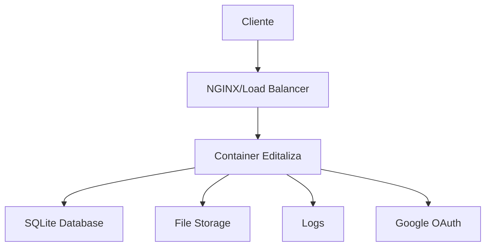

# 🏗️ Arquitetura do Sistema - Editaliza

## 📋 Visão Geral

O Editaliza é uma aplicação Node.js containerizada que segue os princípios 12-factor, preparada para deploy em produção com Docker.

## 🎯 Componentes Principais

### 1. Aplicação Principal
- **Runtime**: Node.js 18+ (Alpine Linux)
- **Framework**: Express.js
- **Banco de Dados**: SQLite (com suporte futuro para PostgreSQL)
- **Autenticação**: JWT + OAuth2 (Google)
- **Upload de Arquivos**: Multer + Storage local

### 2. Containerização
- **Dockerfile**: Multi-stage (builder + runner)
- **Usuário**: não-root (editaliza:1001)
- **Volumes**: `/app/data`, `/app/uploads`, `/app/logs`
- **Healthcheck**: `/health` endpoint

### 3. Configuração
- **Environment**: Variáveis de ambiente (.env)
- **Configs**: Sistema centralizado (`src/config/environment.js`)
- **Logs**: Estruturados (JSON em produção)

## 📁 Estrutura de Diretórios

```
editaliza/
├── src/                          # Código fonte principal
│   ├── config/                   # Configurações
│   │   └── environment.js        # Sistema de env vars
│   ├── controllers/              # Controladores MVC
│   ├── services/                 # Lógica de negócio
│   ├── repositories/             # Acesso a dados
│   └── utils/                    # Utilitários
│       └── logger.js             # Sistema de logs
├── public/                       # Assets estáticos
├── css/                          # Estilos
├── js/                           # Scripts frontend
├── uploads/                      # Arquivos enviados (volume)
├── data/                         # Dados persistentes (volume)
├── logs/                         # Logs da aplicação (volume)
├── docs/                         # Documentação
├── tests/                        # Testes automatizados
├── agents/                       # Agentes de IA
├── Dockerfile                    # Container principal
├── docker-compose.yml            # Desenvolvimento
├── docker-compose.prod.yml       # Produção
├── .env.example                  # Template dev
├── .env.prod.example             # Template produção
└── .dockerignore                 # Exclusões Docker
```

## 🔄 Fluxo de Dados



## 🔐 Segurança

### Autenticação
1. **JWT Tokens**: Access + Refresh tokens
2. **OAuth2**: Google Sign-In
3. **Sessions**: SQLite store para persistência
4. **Rate Limiting**: Por IP e por usuário

### Container Security
1. **Non-root user**: UID 1001
2. **Read-only filesystem**: Exceto volumes necessários
3. **No-new-privileges**: Prevenção de escalação
4. **Resource limits**: Memory e CPU

### Network Security
1. **CORS**: Restrito a domínios específicos
2. **CSP**: Content Security Policy
3. **HSTS**: HTTP Strict Transport Security
4. **Helmet**: Headers de segurança

## 📊 Configurações por Ambiente

### Desenvolvimento
```yaml
NODE_ENV: development
DATABASE: ./db.sqlite (local)
LOGS: stdout (legível)
CORS: http://localhost:3000
RATE_LIMIT: 500/15min
```

### Produção
```yaml
NODE_ENV: production
DATABASE: /app/data/db.sqlite (volume)
LOGS: JSON estruturado
CORS: https://dominio.com
RATE_LIMIT: 100/15min
SSL: Obrigatório
```

## 🚀 Deploy Strategy

### 1. Build Pipeline
```bash
git push → Docker Build → Registry → Deploy
```

### 2. Deployment Types

#### A. Docker Compose (Simples)
```bash
npm run compose:prod
```

#### B. Kubernetes (Escalável)
```yaml
apiVersion: apps/v1
kind: Deployment
metadata:
  name: editaliza
spec:
  replicas: 3
  selector:
    matchLabels:
      app: editaliza
  template:
    spec:
      containers:
      - name: editaliza
        image: editaliza:latest
        ports:
        - containerPort: 3000
```

#### C. Cloud Providers
- **AWS**: ECS + ALB + RDS
- **Google Cloud**: Cloud Run + Cloud SQL
- **Azure**: Container Instances + PostgreSQL

## 📈 Escalabilidade

### Horizontal Scaling
1. **Load Balancer**: NGINX/HAProxy
2. **Multiple Instances**: Docker replicas
3. **Session Sharing**: Redis (futura implementação)
4. **Database**: PostgreSQL cluster

### Vertical Scaling
```yaml
resources:
  limits:
    memory: 1Gi
    cpu: 500m
  requests:
    memory: 512Mi
    cpu: 250m
```

## 🔍 Monitoramento

### Health Checks
- **Liveness**: `/health` (aplicação funcionando)
- **Readiness**: `/ready` (pronto para tráfego)
- **Startup**: 40s initial delay

### Logs Estruturados
```json
{
  "timestamp": "2024-01-01T00:00:00.000Z",
  "level": "info",
  "message": "HTTP 200 - GET /api/users",
  "method": "GET",
  "url": "/api/users",
  "statusCode": 200,
  "duration": "45ms",
  "userId": "123",
  "ip": "192.168.1.1"
}
```

### Métricas
- Response time por endpoint
- Status codes distribution
- Authentication events
- Database query performance
- Error rates

## 🗄️ Banco de Dados

### SQLite (Atual)
```sql
-- Estrutura principal
users (id, email, name, created_at)
study_plans (id, user_id, name, exam_date)
subjects (id, plan_id, name, priority_weight)
topics (id, subject_id, description, priority_weight)
sessions (id, user_id, topic_id, date, status)
```

### Migração para PostgreSQL (Futura)
```yaml
# docker-compose.prod.yml
postgres:
  image: postgres:15-alpine
  environment:
    POSTGRES_DB: editaliza
    POSTGRES_USER: editaliza
    POSTGRES_PASSWORD: ${DB_PASSWORD}
  volumes:
    - postgres_data:/var/lib/postgresql/data
```

## 🔧 Configuração de Ambiente

### Variáveis Críticas
| Variável | Desenvolvimento | Produção | Obrigatório |
|----------|----------------|----------|-------------|
| `SESSION_SECRET` | Qualquer | >32 chars | ✅ |
| `JWT_SECRET` | Qualquer | >64 chars | ✅ |
| `DATABASE_PATH` | `./db.sqlite` | `/app/data/db.sqlite` | ✅ |
| `BASE_URL` | `localhost:3000` | `https://domain.com` | ✅ |
| `GOOGLE_CLIENT_ID` | Dev keys | Prod keys | ✅ |

### Validação de Config
O sistema valida automaticamente:
- Secrets em produção
- Formato de URLs
- Permissões de arquivo
- Conectividade de banco

## 🚦 CI/CD Pipeline

### Estágios Recomendados
```yaml
stages:
  - test:
      - npm run lint
      - npm run test:fortress:full
  - build:
      - docker build
      - docker push
  - deploy:
      - docker-compose pull
      - docker-compose up -d
  - verify:
      - health check
      - smoke tests
```

## 🛡️ Backup Strategy

### Dados a Proteger
1. **Database**: `/app/data/db.sqlite`
2. **Uploads**: `/app/uploads/*`
3. **Configurações**: `.env.prod`

### Backup Automático
```bash
# Script de backup diário
#!/bin/bash
DATE=$(date +%Y%m%d)
docker run --rm \
  -v editaliza_data_prod:/data \
  -v /backup:/backup \
  alpine tar czf /backup/editaliza-$DATE.tar.gz /data
```

## 📝 Performance Tuning

### SQLite Optimizations
```env
SQLITE_CACHE_SIZE=-128000    # 128MB cache
SQLITE_MMAP_SIZE=536870912   # 512MB mmap
SQLITE_BUSY_TIMEOUT=30000    # 30s timeout
```

### Container Optimizations
```dockerfile
# Multi-stage build
FROM node:18-alpine AS builder
# ... build stage

FROM node:18-alpine AS runner
# ... optimized runtime
```

### Memory Management
```yaml
deploy:
  resources:
    limits:
      memory: 512M
      cpus: '0.5'
```

---
**Última atualização:** $(date)
**Versão:** 1.0.0